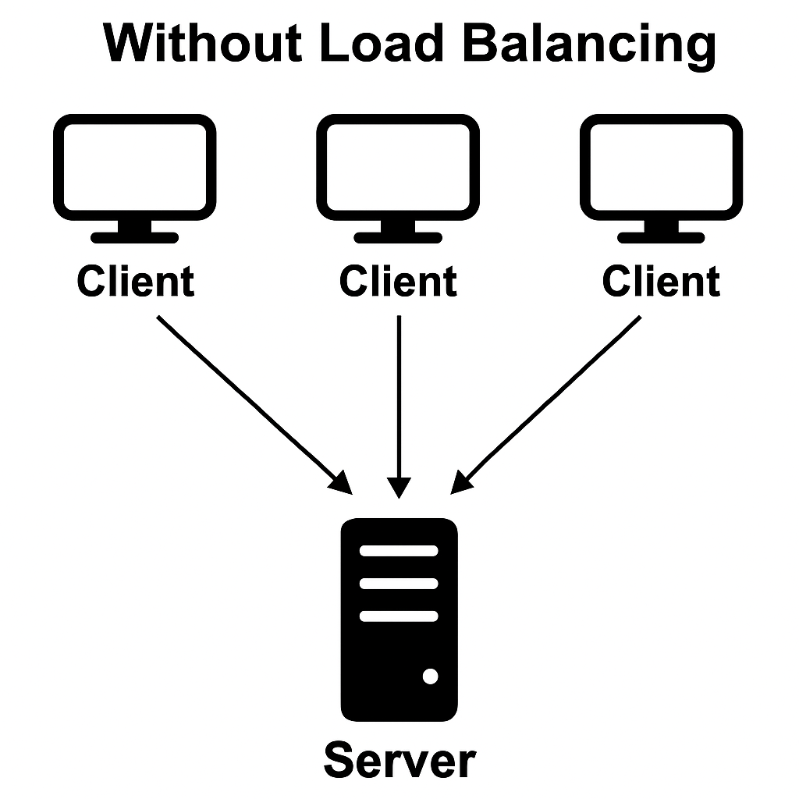
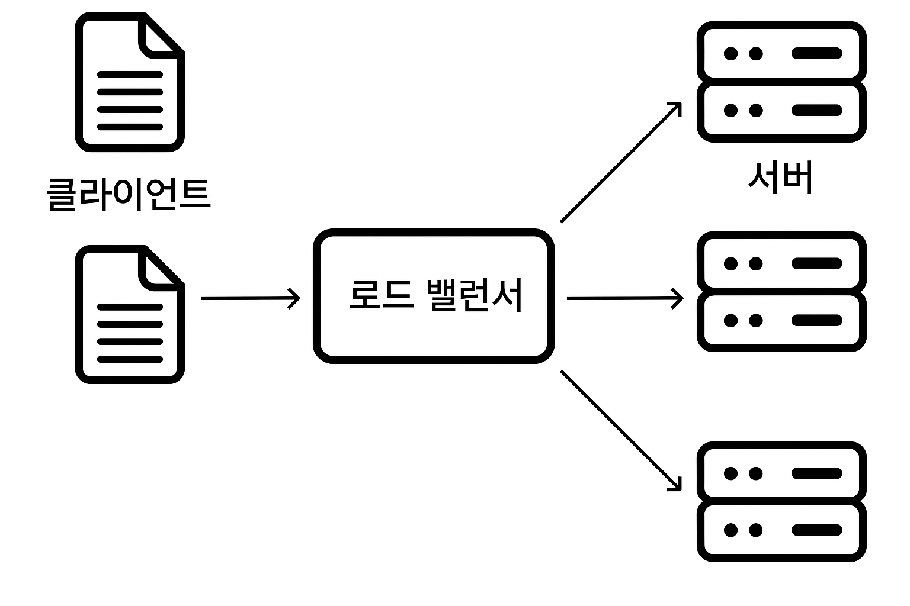

## ⚖️ 로드 밸런싱 (Load Balancing)

### 1️⃣ 정의

- **로드 밸런싱**은 네트워크나 서버에 들어오는 **트래픽(부하)을 여러 서버에 고르게 분산시켜주는 기술**을 말한다.
- 트래픽이 한 곳에 몰리는 걸 방지해서 **서비스의 안정성과 성능을 유지**하는 데 도움을 준다.

---

### 2️⃣ 왜 필요할까? (로드 밸런싱의 필요성)

- 과거에는 웹 서비스가 단순했고, **한 대의 서버만으로도 충분히 처리**가 가능했다.
- 하지만 지금은 서비스가 복잡해지고 사용자 수도 급격히 증가하면서,
    - 하나의 서버가 모든 요청을 처리하기엔 **부하가 너무 커지고**
    - 그로 인해 **서버 다운, 응답 지연** 등의 문제가 발생할 수 있다.
- 그래서 **여러 대의 서버로 요청을 나눠서 처리하는 구조**가 필요해졌고, 그 핵심이 바로 로드 밸런싱!

---

### 🧠 예시 상황

- 쇼핑몰 서버에 사용자 수천 명이 한꺼번에 접속해서 상품을 검색하거나 결제한다면?
- 하나의 서버만 있다면 과부하로 터지기 쉬움
    
    → 이때 로드 밸런서가 **요청을 여러 서버로 나눠줌**으로써 문제 해결!

---

## ⚙️ 로드 밸런서의 동작 방식

로드 밸런서는 **클라이언트의 요청을 받아서** 여러 서버 중 하나로 **알맞게 분산해주는 중간 관리자 역할**을 한다.

### 🔄 기본 흐름

1. 사용자가 웹에 접속하면 요청은 **로드 밸런서로 먼저 도착**
2. 로드 밸런서는 현재 상태를 고려해 **적절한 서버에 요청을 전달**
3. 실제 처리는 서버가 하고, **응답을 다시 로드 밸런서를 거쳐 사용자에게 전달**

> 클라이언트 입장에서는 어떤 서버가 처리했는지 전혀 몰라도 됨

---

## 🧮 로드 밸런싱 알고리즘

로드 밸런서는 요청을 어떻게 분산할지 **알고리즘**에 따라 결정한다.

### 📌 대표적인 알고리즘들

| 알고리즘 | 설명 |
| --- | --- |
| **Round Robin** | 서버들에 요청을 **순차적으로 분산** |
| **Least Connections** | 현재 연결 수가 **가장 적은 서버**에 요청 분산 |
| **IP Hash** | **클라이언트 IP를 해시**해서 특정 서버로 고정 분산 |
| **Weighted Round Robin** | 서버 성능에 따라 **가중치 부여**해 분산 |
| **Random** | 무작위로 서버에 요청 분산 |

---

## 🧱 L4 vs L7 로드 밸런서

로드 밸런서는 **네트워크 계층**에 따라 기능이 달라진다.

### 📊 L4 (전송 계층) 로드 밸런싱

- **IP 주소 + 포트 번호 기반**으로 요청을 분산
- 빠르고 단순하지만 **HTTP 헤더 같은 고급 정보는 못 봄**

> 예: TCP, UDP 수준에서의 분산 처리

---

### 🌐 L7 (애플리케이션 계층) 로드 밸런싱

- **HTTP, URL, 쿠키, 헤더** 등 애플리케이션 레벨 정보 기반 분산
- 사용자의 요청 경로에 따라 다른 서버로 보낼 수 있음

> 예: /images 요청은 이미지 서버, /api 요청은 API 서버 등

---

## 🧪 실제 사용 예시

### 🔧 소프트웨어 기반 로드 밸런서

- **Nginx**: 가볍고 설정이 유연해서 많이 사용됨
- **HAProxy**: 고성능 TCP/HTTP 로드 밸런서

### ☁️ 클라우드 기반 로드 밸런서

- **AWS ELB (Elastic Load Balancer)**
    - Application Load Balancer (L7), Network Load Balancer (L4)
- **Google Cloud Load Balancer**
- **Azure Load Balancer**

---

## ✅ 정리

- **로드 밸런싱**은 서버의 부하를 나눠줘서 **성능과 안정성**을 유지하는 핵심 기술
- 다양한 **알고리즘과 계층별 기능**이 있으며, 상황에 따라 적절한 방식을 선택하는 게 중요함

---

